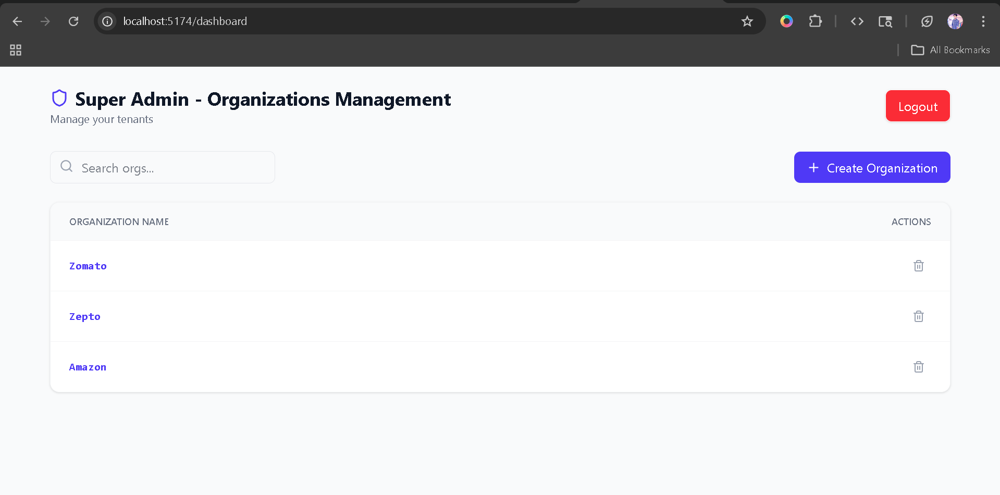
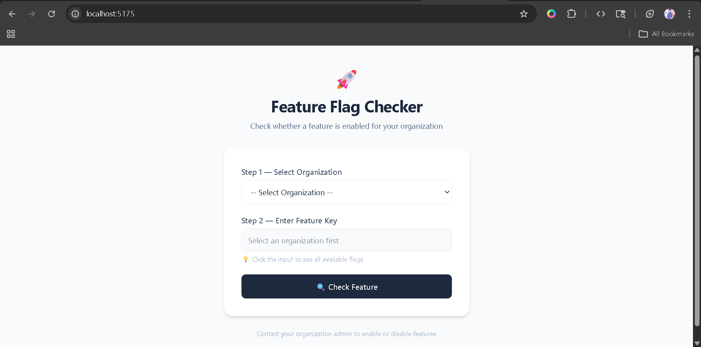

# 🚩 Multi-Tenant Feature Flag Management System

A SaaS-style feature flag management platform built using the **MERN Stack** (MongoDB, Express.js, React.js, Node.js).
This project is structured as **three separate frontend applications** with a centralized backend API.

It supports three different portals:

* **Super Admin Portal** – Manage organizations
* **Organization Admin Portal** – Manage feature flags for their own organization
* **End User Portal** – Check whether a feature is enabled

---

# 📌 Table of Contents

* Overview
* Roles & Permissions
* Tech Stack
* Project Structure
* Data Models
* API Endpoints
* Authentication
* Setup Instructions
* Screenshots

---

# Overview

This platform allows multiple organizations to manage product features without changing code deployments.

### Example Workflow

```text
Super Admin creates organization: Swiggy
        ↓
Swiggy Admin creates feature flag: new_checkout = ON
        ↓
End User checks feature key: new_checkout
        ↓
System Response: Enabled
```

This is commonly used in SaaS products to release features gradually.

---

# Roles & Permissions

| Role               | Access                         |
| ------------------ | ------------------------------ |
| Super Admin        | Create / View Organizations    |
| Organization Admin | Create / Update / Delete Flags |
| End User           | Check Feature Status           |

---

# Tech Stack

## Backend

* Node.js
* Express.js
* MongoDB
* Mongoose
* JWT Authentication
* bcryptjs
* dotenv
* cors

## Frontend

* React.js
* Vite
* React Router DOM
* Axios
* Tailwind CSS
* Lucide-react
* React-toastify

---

# Project Structure

```text
FEATURE-FLAG-SYSTEM/
├── Backend/
├── Frontend/
│   ├── admin-frontend/
│   ├── super-admin-frontend/
│   └── user-frontend/
```

---

# Data Models

## Organization

```js
{ name: String, createdAt: Date }
```

## User

```js
{ name: String, email: String, password: String, role: "admin", organizationId: ObjectId }
```

## Feature Flag

```js
{ featureKey: String, enabled: Boolean, organizationId: ObjectId }
```

---

# API Endpoints

## Authentication

* POST `/api/auth/superadmin/login`
* POST `/api/auth/admin/signup`
* POST `/api/auth/admin/login`

## Organization

* POST `/api/org/create`
* GET `/api/org/list`
* DELETE `/api/org/:id`

## Feature Flags

* POST `/api/flags/create`
* GET `/api/flags/list`
* PUT `/api/flags/:id`
* DELETE `/api/flags/:id`

## User Check Feature

* POST `/api/user/check`
* GET `/api/user/list/:id`

---

# Setup Instructions

## Backend

```bash
cd Backend
npm install
npm run dev
```

## Frontend Apps

```bash
cd Frontend/admin-frontend
npm install
npm run dev
```

```bash
cd Frontend/super-admin-frontend
npm install
npm run dev
```

```bash
cd Frontend/user-frontend
npm install
npm run dev
```

---

# Screenshot


## Super Admin Portal


## Organization Admin Portal


## End User Portal

---
# Author

**Hemanth Kumar M**
BCA Student | MERN Stack Developer
